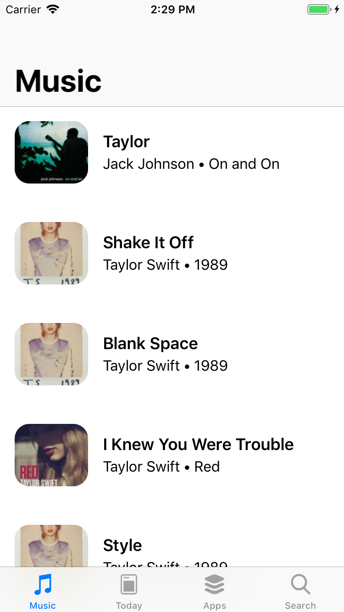

# LikeAppStore

Copy of Apple AppStore with integrated some functionality utilizing iTunes API. 
The app is segmented in 4 main views: Music, Today, Apps, Search

# Musics

It shows integrating iTunes API call for specifics artist music offering pagination while scrolling down.

   

# Today
Shows apps list separated into two types of cells: app per cell, multiple apps per cell. 
Supporting multi-dimensional collection views enabling opening and closing animations 
and dragging animation for triggering closing animation.

  

  

# Apps 
Nested collection views, first cell show apps banners and some info about it, second types of cells shows specific apps per type.
By sellecting GET on specific apps, the description of that app i shown with it specific content like thumnails and comments.

   

# Search
Last view enables searhcing the App store for specific app with iTunes API fetch.

  

# Main Features:
- Programmatically UI (no Stoaryboards)
- Nested UICollectionViews
- Animation using Auto Layout constraints
- Animating Child View Controller objects
- Modeling using JSON Decodable protocol
- JSON Custom Coding Keys
- Asynchronous Data Fetching
- DispatchGroup Fetch Synchronization
- SDWebImage Caching
- Snapping Collection Flow Layout
- Generics Code Reduction and Reusability
- Pagination Data Fetching
- Dependency Injection
- UIVisualEffectView & UIBlurEffect
- Floating Controls
